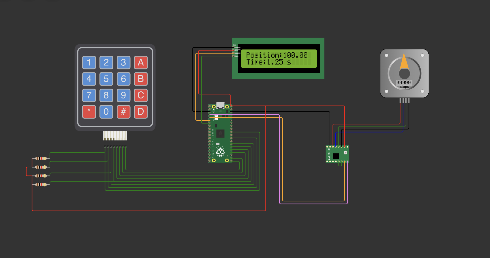

### How to run:

- clone this repo
- make sure you platformio core installed
- to run 'make compile'
- install and check wokwi extension is added
- click on diagram.json file
- click on run button

### Circuit Diagram:

### Input Mapping:

press 1 to change maxVelocity; press c to erase and set new value
press \* to confirm the value

press 2 to change Position; press c to erase and set new value
press \* to confirm the value

press 3 to change Acceleration; press c to erase and set new value
press \* to confirm the value

press 4 to change Microstep; press c to erase and set new value
press \* to confirm the value

press A to change direction; it will set direction to 1 which is clock wise
press B to change direction to anti-clock wise, it will set direction value to -1
